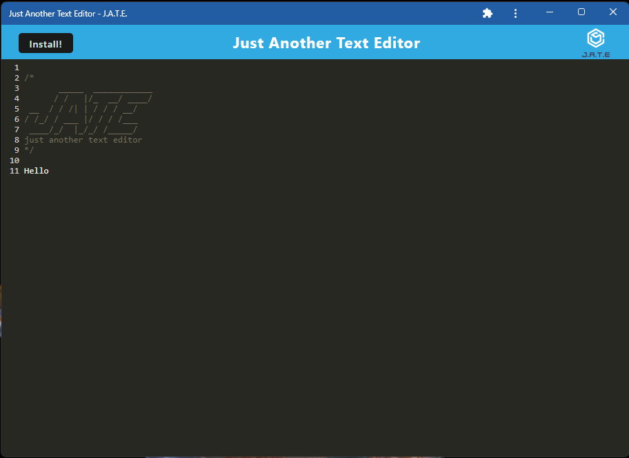
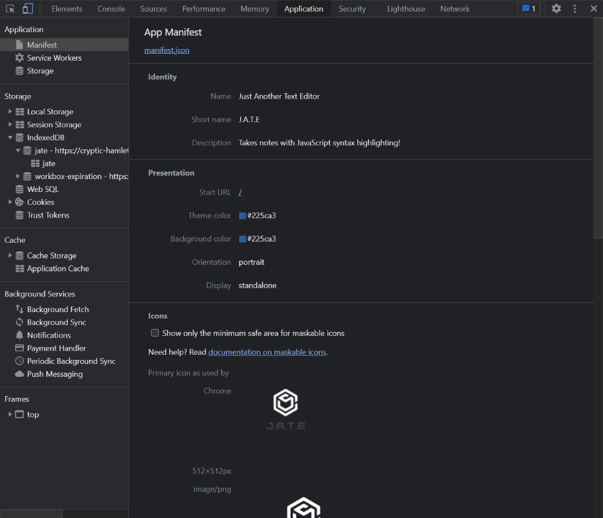
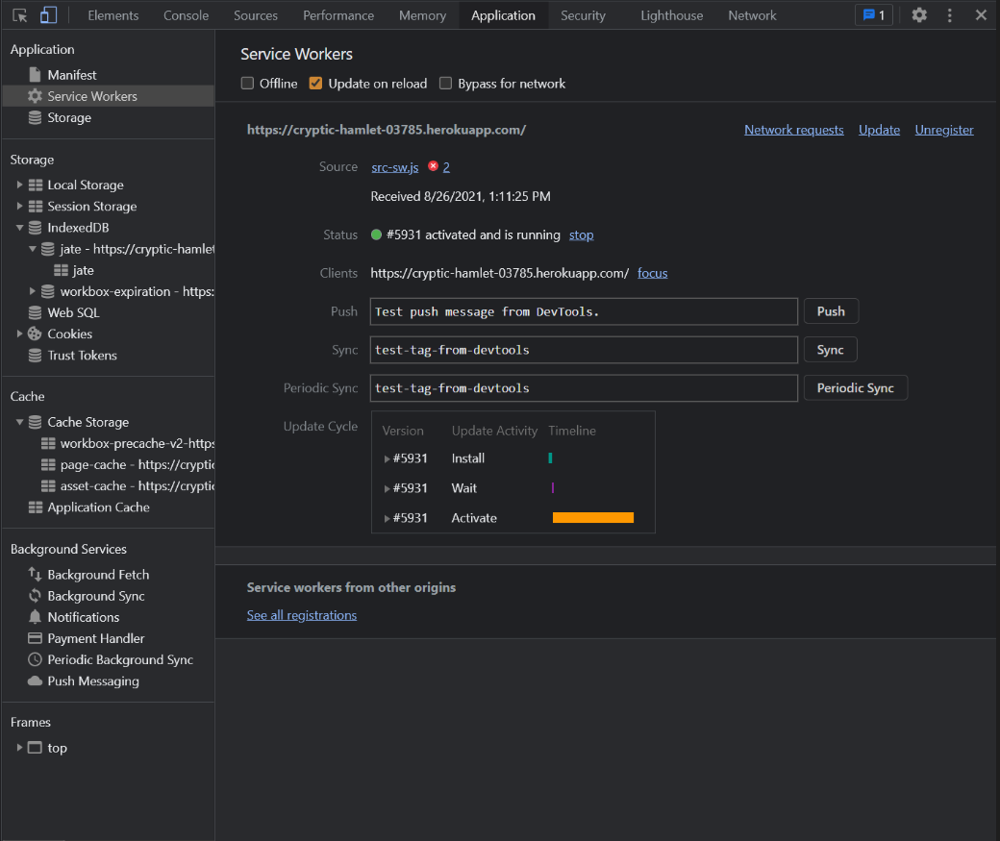
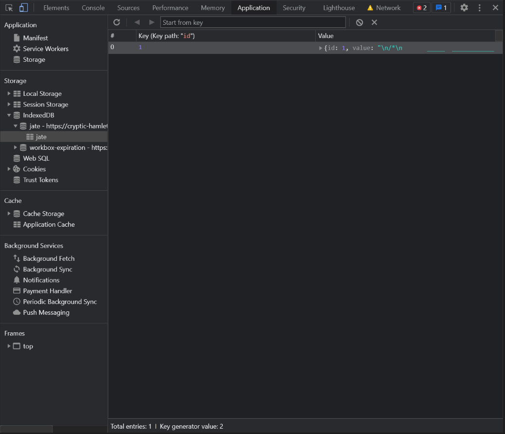

# PWA Text Editor

## Description

This is a simple text editor that runs in the browser. It is a single-page PWA that uses webpack and features several data persistence techniques. It can also function without an internet connection and can be installed on a PC or mobile phone. When installed on your PC, a shortcut to the app will be added to your desktop. When installed on your phone search for "j.a.t.e." and you should see the app.

## Table of Contents
- [Usage](#usage)
- [Deployed Link](#deployed-link)
- [Screenshots](#screenshots)
- [Contribution](#contribution)
- [License](#license)
- [Contact](#contact)

## Usage

When the text editor is opened, database storage is created in IndexedDB. When you enter text and then click away from the window, the text is automatically saved. Once the editor is reopened the saved text will be retrieved from IndexedDB. If you click the install button then the application is downloaded onto your desktop. When the application is loaded there is a registered service worker.

## Deployed Link
https://young-hamlet-07525.herokuapp.com/

## Screenshots

### App installed locally:

### App's manifest.json:

### App's Registered Service Worker:

### IndexedDB storage:

## Contribution
You can contribute [here](https://github.com/jroller33/PWA-Text-Editor).

## License
This project is licensed under the [MIT License](./LICENSE).

## Contact
[GitHub](https://github.com/jroller33)

